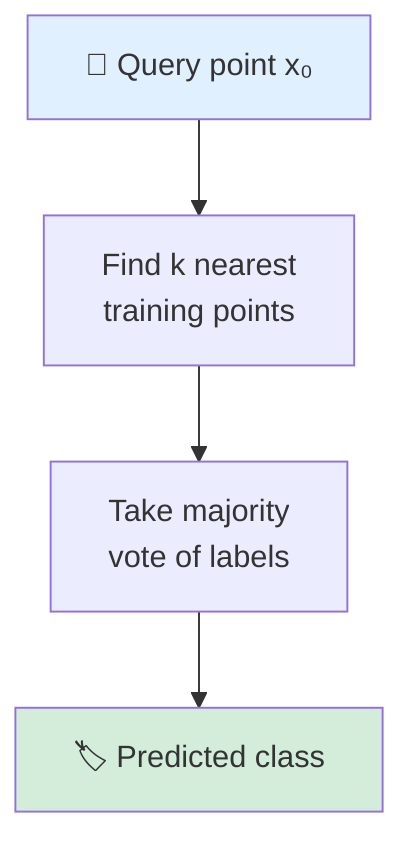

## k-Nearest Neighbors

Image credit: Midjourney  prompt: 'k-Nearest Neighbors'

---
zoom: 0.93
---

# kNN: The Simplest Classifier

* **No training phase** — store all training data (lazy learner)
* At test time: find the $k$ closest training points to query $x_0$
* Classify $x_0$ by **majority vote** among the $k$ neighbors

<v-click>

* kNN algorithm:
	1. **Standardize** features: $x_j \leftarrow \frac{x_j - \bar{x}_j}{\sigma_{x_j}}$ (zero mean, unit variance)
		* Otherwise, features with larger scale **dominate** neighborhoods
	2. Compute distances from $x_0$ to all training points
	3. Find the $k$ nearest neighbors
	4. Return the **mode** (most common label) among them

</v-click>

> *"kNN is the purest form of learning from experience — let the data speak for itself"*
 
> — Yaser Abu-Mostafa

* **Key property**: kNN makes **no assumptions** about the shape of decision boundaries
* Very effective with complex, irregular boundaries

<!--
This is the CORE section — spend time here.
kNN is deceptively simple but very powerful. Students saw it briefly in Lecture 2.
Key points: (1) NO training phase — just store data, (2) ALL computation at test time, (3) standardization is CRITICAL.
Ask: "What happens if one feature is in meters and another in kilometers?" → The km feature dominates.
The Mermaid diagram shows the simplicity of the algorithm.
-->

---
zoom: 0.9
---

# The Effect of $k$: Bias-Variance Tradeoff

### Small $k$ (e.g. $k=1$)
* Decision boundary is **very wiggly**
* Perfect fit to training data → **low bias**
* Very sensitive to noise → **high variance**
* Overfitting risk!

 

### Large $k$ (e.g. $k=N$)
* Decision boundary is **very smooth**
* Ignores local structure → **high bias**
* Stable predictions → **low variance**
* Underfitting risk!

### The sweet spot
* Use **cross-validation** to choose $k$
* Common heuristic: $k \approx \sqrt{N}$
* **Odd** $k$ avoids ties in binary classification

 

| $k$ | Bias | Variance | Boundary |
|-----|------|----------|----------|
| 1 | Lowest | Highest | Jagged |
| $\sqrt{N}$ | Moderate | Moderate | Smooth-ish |
| $N$ | Highest | Lowest | Flat (majority class) |

> *"Always plot training AND test error as a function of k — this is your first diagnostic"* 
> — Andrew Ng
<!--
This is the CLASSIC bias-variance slide — students should know this pattern by now.
Draw the U-shaped test error curve on the board.
k=1: training error is 0 (every point is its own nearest neighbor). Test error is high → overfitting.
k=N: always predicts majority class. Training error = minority class fraction. → underfitting.
The sqrt(N) heuristic is a rough starting point — always validate with CV.
Odd k avoids ties in binary problems.
-->

---
zoom: 0.93
---

# Weighted kNN

* Standard kNN: all $k$ neighbors vote equally
* **Problem**: a far-away neighbor has the same influence as a close one
* **Solution**: weight votes by inverse distance

$$\hat{y} = \arg\max_c \sum_{i \in N_k(x_0)} w_i \cdot \mathbb{1}[y_i = c]$$

* Common weighting schemes:
	* $w_i = \frac{1}{d(x_0, x_i)}$ — inverse distance
	* $w_i = \frac{1}{d(x_0, x_i)^2}$ — inverse squared distance (sharper decay)
	* $w_i = \exp\big(-d(x_0, x_i)^2 / \sigma^2\big)$ — Gaussian kernel

### Benefits of weighting
* **Less sensitive** to the choice of $k$
	* With large $k$, far neighbors contribute little anyway
* Smoother decision boundaries
* For **regression**: weighted average of neighbor values

$$\hat{f}(x_0) = \frac{\sum_{i \in N_k} w_i \cdot y_i}{\sum_{i \in N_k} w_i}$$

* This is a special case of **kernel smoothing** (we'll connect it later)

---
zoom: 0.93
---

# Distance Metrics: Not All Distances Are Equal

### Common metrics
* **Euclidean** ($L_2$): $d(x, y) = \sqrt{\sum_j (x_j - y_j)^2}$
* Default choice — assumes features are equally important
* **Manhattan** ($L_1$): $d(x, y) = \sum_j |x_j - y_j|$
* More robust to outliers in individual features
* **Minkowski** ($L_p$): $d(x, y) = \big(\sum_j |x_j - y_j|^p\big)^{1/p}$
* Generalization of $L_1$ and $L_2$

### Choosing a metric
* **Continuous features**: Euclidean or Manhattan
* **Categorical features**: Hamming distance
* **Mixed features**: Gower's distance
* **Text/high-dimensional sparse**: Cosine similarity

### Critical preprocessing
* ⚠️ **Always standardize features** before kNN
* Feature with range [0, 1000] will dominate one with range [0, 1]
* Consider **feature selection** — irrelevant features add noise to distances (Raschka)

<!--
Distance metrics are underappreciated in practice.
Euclidean is the default but not always the best — depends on data.
Cosine similarity is standard in NLP/embeddings (measures angle, not magnitude).
Stress: ALWAYS standardize. Show example: height in cm [150,190] vs weight in kg [50,100] — height would dominate Euclidean distance.
Feature selection is critical for kNN — unlike trees that can ignore irrelevant features, kNN uses ALL features in distance.
-->

---

# Comparative Study

* K-Means vs LVQ vs $k$NN on 2 simulated problems:
  * All have $X_1, ..., X_{10} ~\overset{\mathrm{iid}}{\sim}~ \mathcal{U}(0,1)$

 

* **Easy**: $Y := I (X_1 > 0.5)$
	* 9 features are just noise

<v-plotly style="width: 350px; height: 200px !important"
:data="[{
x: Array.from({length: 15}, () => Math.random()*0.5),
y: Array.from({length: 15}, () => Math.random()*0),
type: 'scatter',
mode: 'markers',
marker: {color: 'blue', opacity: 0.9},
showlegend: false
},
{
x: Array.from({length: 15}, () => Math.random()*0.5+0.5),
y: Array.from({length: 15}, () => Math.random()*0),
type: 'scatter',
mode: 'markers',
marker: {color: 'orange', opacity: 0.9},
showlegend: false
}]"
:layout="{
xaxis: {zeroline: false},
yaxis: {showticklabels: false, showgrid: false},
margin: {l: 10, r:10, pad: 1}
}"
:config="{displayModeBar: false}"
:options="{}"/>

  * **Hard**: $Y := I \big(\mathrm{sgn}\big[\prod\limits_{j=1}^3 (X_j - 0.5)\big] > 0\big)$
    * 7 features are just noise

<v-plotly style="height: 250px; position: relative"
:data="[{
x: Array.from({length: 999}, () => Math.random()*0.5),
y: Array.from({length: 999}, () => Math.random()*0.5),
z: Array.from({length: 999}, () => Math.random()*0.5),
type: 'scatter3d',
mode: 'markers',
marker: {color: 'blue', size: 4, opacity: 0.7},
showlegend: false
},
{
x: Array.from({length: 999}, () => Math.random()*0.5),
y: Array.from({length: 999}, () => Math.random()*0.6+0.5),
z: Array.from({length: 999}, () => Math.random()*0.5),
type: 'scatter3d',
mode: 'markers',
marker: {color: 'orange', size: 4, opacity: 0.7},
showlegend: false
},
{
x: Array.from({length: 999}, () => Math.random()*0.6+0.5),
y: Array.from({length: 999}, () => Math.random()*0.6+0.5),
z: Array.from({length: 999}, () => Math.random()*0.5),
type: 'scatter3d',
mode: 'markers',
marker: {color: 'blue', size: 4, opacity: 0.7},
showlegend: false
},
{
x: Array.from({length: 999}, () => Math.random()*0.6+0.5),
y: Array.from({length: 999}, () => Math.random()*0.5),
z: Array.from({length: 999}, () => Math.random()*0.5),
type: 'scatter3d',
mode: 'markers',
marker: {color: 'orange', size: 4, opacity: 0.7},
showlegend: false
},
{
x: Array.from({length: 999}, () => Math.random()*0.5),
y: Array.from({length: 999}, () => Math.random()*0.5),
z: Array.from({length: 999}, () => Math.random()*0.6+0.5),
type: 'scatter3d',
mode: 'markers',
marker: {color: 'orange', size: 4, opacity: 0.7},
showlegend: false
},
{
x: Array.from({length: 999}, () => Math.random()*0.5),
y: Array.from({length: 999}, () => Math.random()*0.6+0.5),
z: Array.from({length: 999}, () => Math.random()*0.6+0.5),
type: 'scatter3d',
mode: 'markers',
marker: {color: 'blue', size: 4, opacity: 0.7},
showlegend: false
},
{
x: Array.from({length: 999}, () => Math.random()*0.6+0.5),
y: Array.from({length: 999}, () => Math.random()*0.6+0.5),
z: Array.from({length: 999}, () => Math.random()*0.6+0.5),
type: 'scatter3d',
mode: 'markers',
marker: {color: 'orange', size: 4, opacity: 0.7},
showlegend: false
},
{
x: Array.from({length: 999}, () => Math.random()*0.6+0.5),
y: Array.from({length: 999}, () => Math.random()*0.5),
z: Array.from({length: 999}, () => Math.random()*0.6+0.5),
type: 'scatter3d',
mode: 'markers',
marker: {color: 'blue', size: 4, opacity: 0.7},
showlegend: false
}]"
:layout="{
   scene: {camera: {eye: {x: 1.75, y: -1.25, z:1.05}},
            xaxis: {title: 'x1', range: [0.01,1]},
            yaxis: {title: 'x2', range: [0.,1]},
            zaxis: {title: 'x3', range: [0.,1]}},
   margin: {l: 20, r:20, b:2, t:1, pad: 5}
}"
:config="{displayModeBar: false}"
:options="{}"/>

---
zoom: 0.92
---

# Comparative Study: Results

 

* **Easy problem** (linear boundary):
	* k-Means and LVQ perform well — boundary is simple, prototypes capture it
	* kNN wastes capacity on noise dimensions
* **Hard problem** (complex boundary):
	* kNN **outperforms** — can adapt to arbitrary boundaries
	* k-Means and LVQ can't represent the complex checkerboard pattern
* **Takeaway**: the best method depends on the boundary complexity!

  <figure>
    
    <figcaption style="color:#b3b3b3ff; font-size: 11px;"> 
Image source:
      <a href="https://hastie.su.domains/ElemStatLearn/">ESL Fig. 13.5</a>

    </figcaption>
  </figure>

---
zoom: 0.9
---

# Ex: $k$NN for STATLOG Project (Satellite Image Classification)

 

* **Goal**: classify pixels of aerial images into 7 agricultural land use classes: cotton, vegetation stubble, mix, red soil, gray soil, damp gray soil, very damp gray soil 
  <figure>
    
    <figcaption style="color:#b3b3b3ff; font-size: 11px;">
Image source:
      <a href="https://hastie.su.domains/ElemStatLearn/">ESL Fig. 13.6</a>

    </figcaption>
  </figure>

* Each $x_i \in \R^{36}$ is built with 9 adjacent pixels from 4 spectral images
* $5$-NN resulted in **9.5% error**
* Better than many classifiers:
  <figure>
    
    <figcaption style="color:#b3b3b3ff; font-size: 11px;">
Image source:
      <a href="https://hastie.su.domains/ElemStatLearn/">ESL Fig. 13.8</a>

    </figcaption>
  </figure>

---
zoom: 0.9
---

# Computational Cost of kNN

### The problem
* **Prediction time**: $O(N \cdot p)$ per query (brute force)
* Must compute distance to **every** training point
* For large $N$, this is painfully slow
* **No training cost**, but **expensive at test time**
* Opposite of most ML methods!

### Scaling challenges (Karpathy)
* 1M training points, 100 features → 100M operations per query
* In production: can't wait seconds per prediction

### Solutions: Approximate Nearest Neighbors
* **KD-Trees**: partition space recursively
	* $O(p \cdot \log N)$ per query (on average)
	* Degrades in high dimensions ($p > 20$)
* **Ball Trees**: use hyperspheres instead of hyperplanes
	* Better for high dimensions than KD-Trees
* **Locality-Sensitive Hashing (LSH)**:
	* Hash similar points to same bucket
	* Sub-linear query time; approximate but fast
* **FAISS**: GPU-accelerated ANN search
	* Handles billions of vectors

* **Rule of thumb**: for $p > 20$ and $N > 10\text{K}$, use approximate methods

<!--
This is a practical slide — students will need this for projects.
Brute force: O(Np) per query. For 1M points and 100 features = 100M operations.
KD-trees: great for low dimensions, but degrade when p > 20 (curse of dimensionality again).
FAISS from Meta is the production standard — can handle billions of vectors on GPU.
In practice: scikit-learn uses KD-tree or Ball-tree automatically based on dimensions.
Mention: this is what powers similarity search in recommendation engines, image search, etc.
-->
